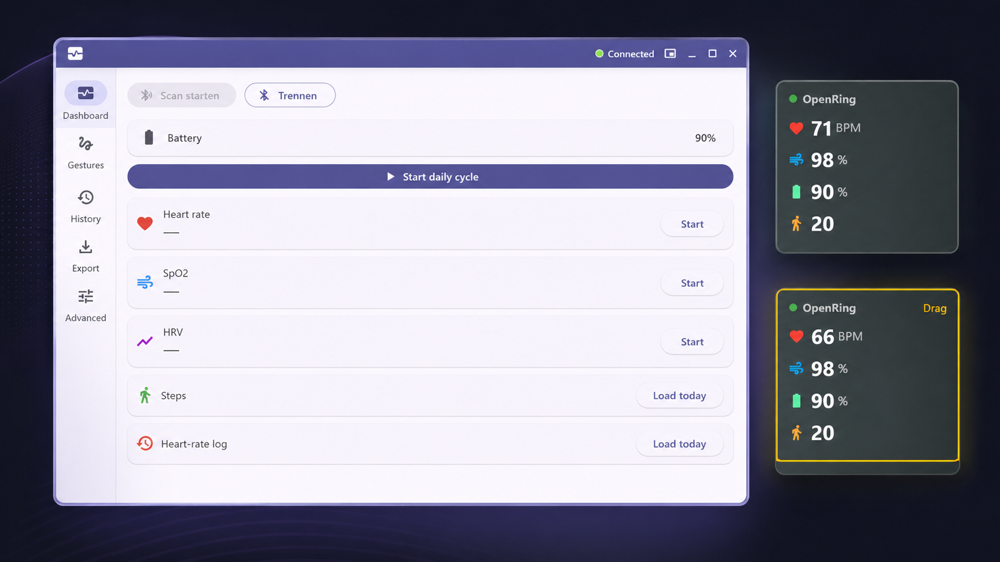
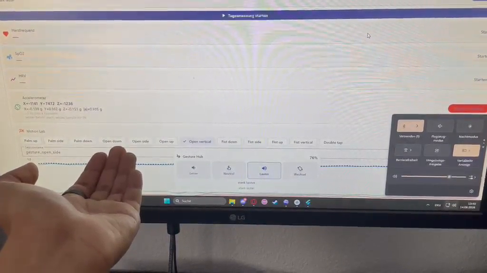

  

# OpenRing Desktop

OpenRing Desktop is an experimental desktop app for Colmi-compatible smart rings. 
It connects directly over Bluetooth Low Energy and provides local-first access
to live measurements, history, an always-on-top overlay and
ring-based gesture controls. Currently tested with the Colmi R02 and R03. 
Windows 11 is the primary tested desktop platform.

> The app is not a medical device. It is intended for personal tracking and experimentation only.

  

## Motivation

Colmi smart rings currently depend on the mobile QRing app, which stores data in the cloud. 
The app explores an alternative, desktop-native path instead. Vital data is stored locally 
on your own device. The app communicates with the ring directly over BLE and surfaces live vitals 
while you work, including through an always-on-top overlay for quick-glance monitoring.

The project also investigates how much of the ring hardware can be used. This includes 
reverse-engineered packet handling, accelerometer recordings
and experimental ring-based gesture controls.

The reverse-engineered BLE packet structure is documented in
[protocol.md](docs/protocol.md) and the overall application structure is
summarized in [architecture.md](docs/architecture.md).

## What It Can Do

### Device & Connection

The software can scan for nearby Colmi-compatible rings over BLE, connect to and
disconnect from a selected ring and read the battery level and charging state.
You can sync the ring's internal clock with the desktop system time and trigger
utility commands such as making the ring blink or performing a reboot.

### Live Measurements

Once connected, the app displays live heart rate, SpO2, HRV and accelerometer
readings. A rotating daily measurement cycle can be started from within the app
and heart-rate log settings can both be queried and updated directly.

Live optical measurements are scheduled one after another because the ring does
not expose them as independent parallel streams. The current scheduling approach
is described in [measurement-scheduling.md](docs/measurement-scheduling.md).

### History & Log Retrieval

The app can request heart-rate log data and step/activity log data from the
ring. All retrieved data, including devices, vitals, battery snapshots and
activity intervals, is stored in a local SQLite database. History charts for
heart rate, SpO2, HRV and activity are available directly within the interface.

The local database structure is documented in
[database-schema.md](docs/database-schema.md). Live heart-rate values can arrive in short groups. 
The history graph places these values on the timeline in a more readable way, as explained in
[live-heart-rate-history.md](docs/live-heart-rate-history.md).

### Gesture Hub

The desktop app can turn held ring positions into simple desktop controls. The current
Gesture Hub supports volume control, scrolling, step-based cursor movement and
a left click gesture.

The gesture mapping is based on accelerometer recordings from the Motion Lab.
Because the observed stock-firmware accelerometer stream is 1 Hz,
the software uses stable held hand positions.

The Gesture Hub behavior is documented in [gesture-hub.md](docs/gesture-hub.md).
The accelerometer measurements behind the gesture centers are described in
[motion-research-lab.md](docs/motion-research-lab.md).

  

  <em>Gesture Hub demo: volume control, mouse movement and scrolling using ring accelerometer data.</em>

### Desktop Integration

The app features an integrated always-on-top overlay that can be toggled with
global hotkeys and a system tray menu that remains accessible while overlay
mode is active. During development, the local SQLite database can be inspected
directly. Deterministic protocol parsing, as well as selected scheduler and
storage behavior, is covered by tests.

Overlay behavior is documented in [overlay.md](docs/overlay.md). The test setup
and covered areas are summarized in [testing.md](docs/testing.md).

## Medical Disclaimer

This app is not a medical device and must not be used for diagnosis, treatment,
or emergency monitoring. Values shown by the app depend on consumer hardware,
reverse-engineered protocol behavior and ongoing experimental software.

## License

This desktop app is released under the MIT License. See [LICENSE](LICENSE).
