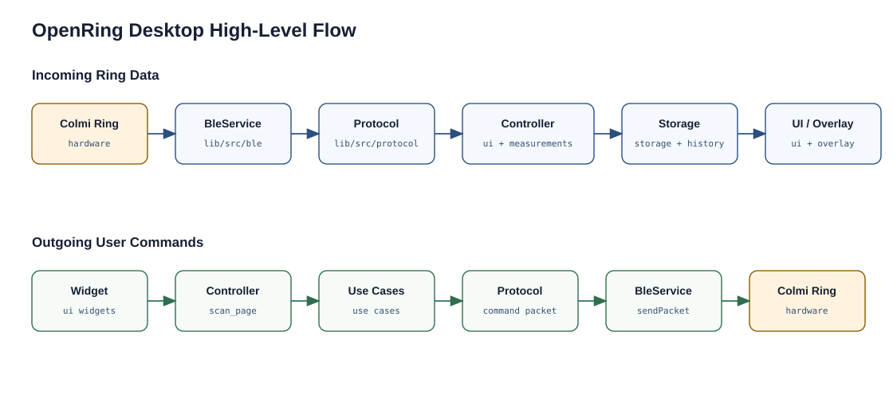

# Architecture Overview

This document explains the technical structure of OpenRing Desktop v1.0. It
provides a high-level map of the main modules, their
responsibilities, and the data flow between the ring, protocol layer, storage,
UI, overlay and Gesture Hub.

The goal of the architecture is to keep hardware communication, protocol
parsing, local storage and UI behavior separated. This makes the implemented
features easier to explain, test and extend without mixing them.

## Architectural Goals

- separate BLE transport, protocol parsing, local storage and UI behavior
- keep protocol parsing deterministic and covered by automated tests
- route UI actions through dedicated controller, use-case and service layers
- keep the overlay integrated with the main app because the ring supports only
  one active BLE connection

## High-Level Flow

At a high level, live data flows through the app like this:

| Flow Step | Main Code Location |
| --- | --- |
| Colmi ring sends BLE notification | ring hardware |
| BLE notification is received and exposed as packet stream | [lib/src/ble/ble_service.dart](../lib/src/ble/ble_service.dart) |
| Packet bytes are parsed into typed responses | [lib/src/protocol/](../lib/src/protocol/) |
| Live state and measurement timing are coordinated | [lib/src/ui/scan_page_controller.dart](../lib/src/ui/scan_page_controller.dart), [lib/src/measurements/daily_measurement_cycle.dart](../lib/src/measurements/daily_measurement_cycle.dart) |
| Values are stored or loaded for history | [lib/src/storage/storage_repository.dart](../lib/src/storage/storage_repository.dart), [lib/src/history/history_page_controller.dart](../lib/src/history/history_page_controller.dart) |
| Values are rendered in dashboard, history, or overlay | [lib/src/ui/](../lib/src/ui/), [lib/src/history/](../lib/src/history/), [lib/src/overlay/](../lib/src/overlay/) |

BLE notifications are received by `BleService`, parsed by the protocol layer,
coordinated by the page controller and measurement-related components, then
either stored locally or rendered in the dashboard, history view, or overlay.

Commands flow in the opposite direction:

| Flow Step | Main Code Location |
| --- | --- |
| User action starts in a widget callback | [lib/src/ui/scan_page.dart](../lib/src/ui/scan_page.dart), [lib/src/ui/scan_page_widgets.dart](../lib/src/ui/scan_page_widgets.dart) |
| Page controller handles the action | [lib/src/ui/scan_page_controller.dart](../lib/src/ui/scan_page_controller.dart) |
| UI-facing use case builds or sends the command | [lib/src/ui/scan_page_use_cases.dart](../lib/src/ui/scan_page_use_cases.dart) |
| Protocol command packet is constructed | [lib/src/protocol/](../lib/src/protocol/) |
| BLE service sends the packet to the ring | [lib/src/ble/ble_service.dart](../lib/src/ble/ble_service.dart) |

Widget callbacks are routed through the controller and use-case layer before a
protocol packet is sent through `BleService`.

This separation keeps widgets focused on presentation and keeps protocol logic
independent from Flutter UI code.

A more detailed breakdown of incoming data, persistence, history loading,
overlay state, and outgoing commands is documented in
[data-flow.md](data-flow.md).

## BLE Layer

The BLE layer lives in [lib/src/ble/](../lib/src/ble/).

`BleService` owns the low-level Bluetooth interaction:

- scanning for nearby devices
- filtering likely Colmi rings by advertised name
- connecting and disconnecting
- discovering the Nordic UART Service used by the ring
- subscribing to notification packets
- sending validated command packets
- exposing packet and connection-status streams

## Protocol Layer

The protocol layer lives in [lib/src/protocol/](../lib/src/protocol/).

This layer contains deterministic packet builders and parsers for known Colmi
commands and responses. 

Examples of protocol responsibilities:

- packet checksum validation
- command packet construction
- battery response parsing
- real-time reading parsing
- heart-rate log parsing
- heart-rate settings parsing
- step/activity log parsing
- accelerometer parsing
- utility commands such as time sync, blink, and reboot

## UI Layer

The main dashboard UI lives in [lib/src/ui/](../lib/src/ui/).

The current UI split is:

- [scan_page.dart](../lib/src/ui/scan_page.dart) for page composition and navigation between dashboard,
  Gesture Hub, history, export, and advanced controls
- [scan_page_widgets.dart](../lib/src/ui/scan_page_widgets.dart) for reusable dashboard widgets and cards
- [scan_page_controller.dart](../lib/src/ui/scan_page_controller.dart) for page state and orchestration
- [scan_page_use_cases.dart](../lib/src/ui/scan_page_use_cases.dart) for UI-facing BLE command operations

## Storage Layer

The storage layer lives in [lib/src/storage/](../lib/src/storage/).

OpenRing currently uses Drift with SQLite. 

The database stores:

- known devices
- app settings
- vital samples
- battery snapshots
- activity intervals
- motion recording sessions
- motion samples

The storage repository maps parsed ring data into local models that can be used
by history views, Motion Lab, Gesture Hub analysis, and data export.

## History Layer

The history layer lives in [lib/src/history/](../lib/src/history/).

It is responsible for loading local data and rendering historical views for:

- heart rate
- SpO2
- HRV
- activity intervals

Chart calculation is kept separate from widgets where practical, so model-level
behavior can be tested without launching the full UI.

Live heart-rate samples need special handling because the ring reports values in
blocks rather than as a simple stream of independent point measurements. The
current visualization heuristic is documented separately in:

- [live-heart-rate-history.md](live-heart-rate-history.md)

## Data Export

The data export feature lives in [lib/src/data_export/](../lib/src/data_export/).

It reads selected local database tables through `ExportRepository`, converts the
selected date range into export models, and formats the result as a user-facing
file. It reads from local storage.

## Overlay Architecture

The overlay lives in [lib/src/overlay/](../lib/src/overlay/).

OpenRing uses an integrated overlay mode instead of a separate app or second
window pipeline. This is an important architectural choice because the ring
supports only one active BLE connection.

When overlay mode is active, the main app window is resized and reconfigured
using `window_manager`. The overlay controller manages:

- always-on-top behavior
- skip-taskbar behavior
- click-through mode
- interactive positioning mode
- opacity
- tray menu integration
- global hotkeys

## Gesture Hub

The Gesture Hub lives in [lib/src/gesture_hub/](../lib/src/gesture_hub/).

It turns held accelerometer positions into coarse desktop controls:

- scrolling
- relative volume changes
- mouse movement and left click

The Gesture Hub deliberately avoids fast tap or swipe detection because the
observed stock-firmware accelerometer stream is roughly `1 Hz`. Instead, it
uses calibrated held positions from Motion Lab recordings. The detailed
gesture data collection, control mapping and Windows input services
are documented in:

- [gesture-hub.md](gesture-hub.md)
- [motion-research-lab.md](motion-research-lab.md)

## Testing Strategy

Current automated test areas include:

- packet validation and parsing
- command packet building
- storage repository behavior
- data export repository, formatter, controller, and widget behavior
- history chart model calculations
- live heart-rate timestamp reconstruction
- daily measurement sequencing
- UI controller behavior for scanning, connection, measurements, and
  accelerometer stop handling
- Motion Lab analysis and Gesture Hub control behavior
- overlay widget behavior

The detailed test layout, commands, and documentation rules are described in
[testing.md](testing.md).

## Related Documents

- [README.md](../README.md)
- [protocol.md](protocol.md)
- [live-heart-rate-history.md](live-heart-rate-history.md)
- [database-schema.md](database-schema.md)
- [data-flow.md](data-flow.md)
- [measurement-scheduling.md](measurement-scheduling.md)
- [overlay.md](overlay.md)
- [gesture-hub.md](gesture-hub.md)
- [testing.md](testing.md)
- [specs/initial-requirements.md](specs/initial-requirements.md)
- [specs/use-case-diagram.puml](specs/use-case-diagram.puml)
- [hardware-notes.md](hardware-notes.md)
- [ai-assistance.md](ai-assistance.md)

## AI Assistance Disclosure

This document was checked and corrected with AI assistance to ensure that the
architecture description matches the existing project source code. The content
was reviewed by the author.
