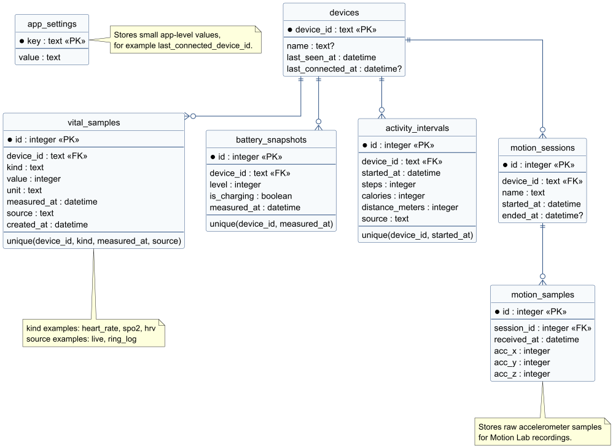

# Database Schema

OpenRing stores ring data locally in SQLite. The database is accessed through
Drift, so the schema is defined in Dart in
[lib/src/storage/app_database.dart](../lib/src/storage/app_database.dart)
and generated into SQLite tables.

The schema is built around one central device table. Time-based data references
the ring by `device_id`, which allows OpenRing to store values from more than
one ring without mixing their histories.




## Tables

| Table | Purpose |
| --- | --- |
| `devices` | Known rings, their display name, last seen time, and last connected time |
| `app_settings` | Small key/value settings, such as the last connected ring |
| `vital_samples` | Heart rate, SpO2, and HRV samples with timestamp, unit, and source |
| `battery_snapshots` | Battery level and charging state at a point in time |
| `activity_intervals` | Step, calorie, and distance values for activity intervals |
| `motion_sessions` | Motion Lab recording sessions for accelerometer data collection |
| `motion_samples` | Accelerometer samples that belong to a motion recording session |

## `devices`

Stores rings that OpenRing has seen or connected to.

| Column | Type | Notes |
| --- | --- | --- |
| `device_id` | text | Primary key. Usually the BLE device identifier used by the app |
| `name` | text, nullable | Advertised or displayed ring name |
| `last_seen_at` | datetime | Last time the ring was discovered or used |
| `last_connected_at` | datetime, nullable | Last successful connection time |

## `app_settings`

Stores small application settings as key/value rows.

| Column | Type | Notes |
| --- | --- | --- |
| `key` | text | Primary key |
| `value` | text | Stored setting value |

Example: `last_connected_device_id` stores which ring should be treated as the
current ring for history loading.

## `vital_samples`

Stores time-series vital measurements.

| Column | Type | Notes |
| --- | --- | --- |
| `id` | integer | Auto-increment primary key |
| `device_id` | text | Foreign key to `devices.device_id` |
| `kind` | text | Measurement kind, such as `heart_rate`, `spo2`, or `hrv` |
| `value` | integer | Numeric measurement value |
| `unit` | text | Unit, such as `bpm`, `%`, or `ms` |
| `measured_at` | datetime | Measurement timestamp |
| `source` | text | Origin of the sample, such as `live` or `ring_log` |
| `created_at` | datetime | Time when OpenRing stored the row |

Unique key:

```text
device_id + kind + measured_at + source
```

This prevents duplicate vital samples while still allowing OpenRing to keep
live readings and synced ring-log readings separate.

## `battery_snapshots`

Stores battery state over time.

| Column | Type | Notes |
| --- | --- | --- |
| `id` | integer | Auto-increment primary key |
| `device_id` | text | Foreign key to `devices.device_id` |
| `level` | integer | Battery percentage |
| `is_charging` | boolean | Whether the ring reports that it is charging |
| `measured_at` | datetime | Snapshot timestamp |

Unique key:

```text
device_id + measured_at
```

## `activity_intervals`

Stores activity values for a specific time interval.

| Column | Type | Notes |
| --- | --- | --- |
| `id` | integer | Auto-increment primary key |
| `device_id` | text | Foreign key to `devices.device_id` |
| `started_at` | datetime | Start of the activity interval |
| `steps` | integer | Step count for the interval |
| `calories` | integer | Calories for the interval |
| `distance_meters` | integer | Distance for the interval |
| `source` | text | Origin of the data, such as `ring_log` |

Unique key:

```text
device_id + started_at
```

## `motion_sessions`

Stores Motion Lab recording sessions.

| Column | Type | Notes |
| --- | --- | --- |
| `id` | integer | Auto-increment primary key |
| `device_id` | text | Foreign key to `devices.device_id` |
| `name` | text | User-visible recording name |
| `started_at` | datetime | Start time of the recording |
| `ended_at` | datetime, nullable | End time of the recording |

## `motion_samples`

Stores accelerometer samples for a Motion Lab recording session.

| Column | Type | Notes |
| --- | --- | --- |
| `id` | integer | Auto-increment primary key |
| `session_id` | integer | Foreign key to `motion_sessions.id` |
| `received_at` | datetime | Time when OpenRing received the sample |
| `acc_x` | integer | Accelerometer X-axis value |
| `acc_y` | integer | Accelerometer Y-axis value |
| `acc_z` | integer | Accelerometer Z-axis value |


## AI Assistance Disclosure

This document was checked and corrected with AI assistance to ensure that the
database schema description matches the existing project source code. The
content was reviewed by the author.
