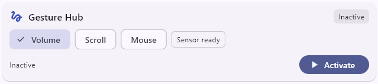
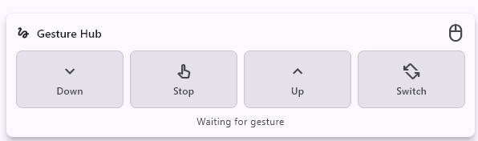
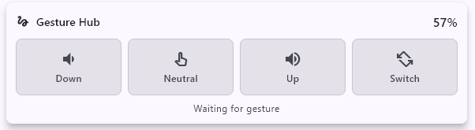
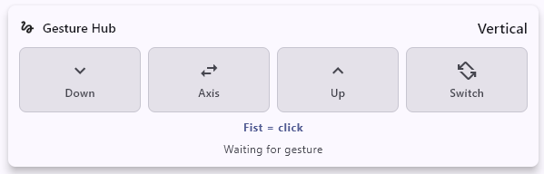

# Gesture Hub

The Gesture Hub is the central control card for ring-based desktop interaction
with held hand positions. It builds on Motion Lab recordings and uses the
ring's accelerometer stream.

The current implementation is useful for simple actions such as scrolling,
volume changes and step-based cursor movement along the X and Y axes. It is not
intended as a full mouse replacement. The main limitation is the observed
accelerometer update rate of about `1 Hz`, which makes fine movement
unreliable.

## Goal

The feature makes several quick system controls available through the same ring:

- scrolling
- volume control
- mouse control

It uses one central activation. After activation, the user can switch between
controls by holding specific hand positions.



A short demonstration video is available in
[Gesture.mp4](../assets/Gesture.mp4).

The current control logic uses these main positions:

| Position | Purpose |
| --- | --- |
| `palm_up` | Scroll up, increase volume, or move the cursor up/left depending on the active control |
| `palm_down` | Scroll down, decrease volume, or move the cursor down/right depending on the active control |
| `palm_side` | Neutral/resting position in most controls; switches the mouse axis after a short hold |
| `palm_vertical` | Switches between Gesture Hub controls |
| `fist_down` | Left click in mouse control |

## Activation

Activation is available from the dashboard card or with the global hotkey
`Ctrl + Shift + M`.

## Measured Open-Hand and Fist Positions

The current classifier uses measured hand-position centers from Motion Lab. The
recording method is described in [motion-research-lab.md](motion-research-lab.md).
Values are rounded and shown in `g`.

| Gesture Hub Position | Source | xG | yG | zG | Roll |
| --- | --- | ---: | ---: | ---: | ---: |
| `palm_down` | `gesture_open_down` | `+0.101` | `-1.041` | `-0.004` | `-90.1 deg` |
| `palm_side` | `gesture_open_side` | `-0.141` | `-0.086` | `+0.841` | `-5.9 deg` |
| `palm_up` | `gesture_open_up` | `-0.160` | `+0.907` | `-0.041` | `+92.6 deg` |
| `palm_vertical` | `gesture_open_vertical` | `-1.023` | `-0.179` | `-0.072` | `-108.0 deg` |
| `fist_down` | `gesture_fist_down` | `+0.938` | `-0.131` | `+0.026` | `-83.6 deg` |

## Classification

Each live accelerometer sample is compared with the measured centers in 3D
space:

```text
distance = sqrt((xG - centerX)^2 + (yG - centerY)^2 + (zG - centerZ)^2)
```

The sample is assigned to the position with the smallest distance.

## Switching Controls

The active control mode changes when `palm_vertical` is held for about `1.2 s`.

The modes rotate in this order:

```text
scroll -> volume -> mouse -> scroll
```

A single hold changes the mode only once. To switch again, the hand must first
leave the `palm_vertical` position and then return to it.

## Control: Scroll

Scrolling is step-based. Each detected `palm_up` or `palm_down` position sends
one scroll step.



| Hand position | Scroll action |
| --- | --- |
| `palm_up` | Scroll up |
| `palm_side` | No scrolling |
| `palm_down` | Scroll down |

## Control: Volume

Volume control changes the current system volume in small relative steps.



| Hand position | Volume action |
| --- | --- |
| `palm_up` | Increase volume |
| `palm_side` | Keep current volume |
| `palm_down` | Decrease volume |

The control uses the roll angle of the current accelerometer value:

```text
roll = atan2(yG, zG)
```

The measured `palm_side` position is used as the resting angle. While the current
roll angle stays close to this resting angle, the volume is not changed. The
farther the roll angle moves away from the resting angle, the larger the volume
step becomes.

## Control: Mouse

Mouse control moves the cursor in steps. It uses one active movement axis at a
time: vertical or horizontal. The default axis is vertical.



| Hand position | Vertical axis | Horizontal axis |
| --- | --- | --- |
| `palm_up` | Move cursor up | Move cursor left |
| `palm_side` | Stop movement | Stop movement |
| `palm_down` | Move cursor down | Move cursor right |

Holding `palm_side` briefly switches between the vertical and horizontal axis.
A single hold changes the axis only once. To switch again, the hand must first
leave `palm_side` and then return to it.

| Hand position | Mouse action |
| --- | --- |
| `fist_down` | Left click |

The click is also sent only once per fist hold. A new click can be triggered
only after leaving the fist position. In `scroll` and `volume`, `fist_down` does
nothing.

## Implementation and Tests

Native desktop actions use platform services. On Windows, volume control uses
`CoreAudio` and scrolling, mouse movement and clicking use `SendInput`.

Automated tests cover classification, control switching, scrolling, volume
changes, mouse-axis switching, left click behavior and widget display states.
The general test setup is documented in [testing.md](testing.md).

## Current Limits

- Mouse control moves in steps and is mainly useful for reaching individual UI
  targets.
- No dragging gesture.
- No right click.
- No double click.
- No adaptive cursor acceleration.
- Calibration values were measured with the current ring and wearing setup.
  They may need to be recorded again for another ring, firmware version, hand,
  or if the ring is worn rotated differently on the finger.
