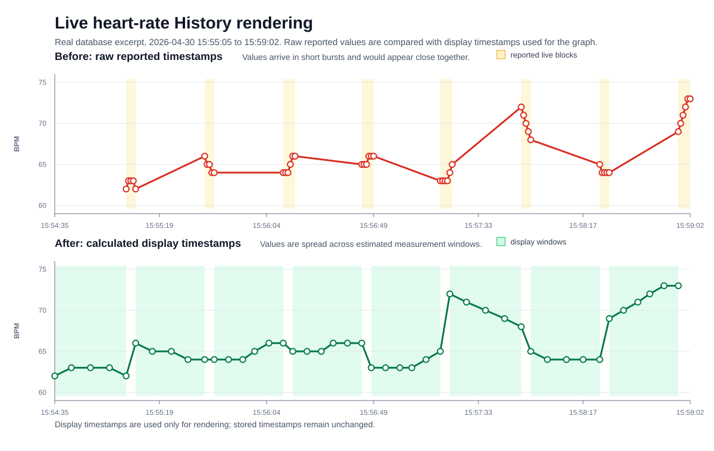

# Live Heart-Rate History Rendering

This document describes how timestamps for live heart-rate values are handled
when rendering the History graph.

## Background

The COLMI ring does not provide live heart-rate values as a continuous stream of
independent point measurements. Instead, values arrive in blocks. The number of values 
in each block varies.

Each reported timestamp has a corresponding BPM value. However, the BPM value is
calculated from multiple PPG samples rather than from one single optical sample.
The timestamp should therefore be understood as the reporting time of a computed
heart-rate value, not as the exact time of one instantaneous sensor reading.

In the observed live heart-rate data, the timestamps inside one block increase
by one second from value to value.

To interpret these timestamps, the visible green PPG LED behavior was compared
with the reported timestamp values. In the observed recordings, the time at
which the LED turned off matched the first timestamp of the reported block.

The exact timestamp semantics of the COLMI live protocol are not officially
documented. The History graph therefore uses an empirically motivated display heuristic.

## Display Timestamp Calculation

For rendering, separate display timestamps are calculated without changing the
stored timestamps.

For the graph, the previously described live heart-rate blocks are grouped into
one display segment when their values are no more than 6 seconds apart. In the
observed data, values from the same active measurement phase appeared close
together, while a larger gap indicated that the ring had stopped that
measurement phase and later started a new one.

The estimated measurement window ends at the first timestamp of the current
display segment. The values in the segment are then distributed evenly between
the calculated start and end time. This spreads them over the time range in
which the optical measurement most likely took place.

- If a previous display segment exists within 1 minute, the current measurement
  window starts 4 seconds after the estimated end of the previous segment.

- If no previous display segment exists within 1 minute, the current measurement
  window starts 30 seconds before the estimated end of the current segment.

The calculated display timestamps are used only for graph rendering. They are
estimates and must not be interpreted as exact sensor measurement times. Their
purpose is to produce a more continuous and plausible History graph for
blockwise live heart-rate data.

The comparison below shows the same live heart-rate excerpt before and after
the display timestamp calculation.

## Assumptions and Limits

The timestamp adjustment is intentionally limited to graph rendering:

- Only live heart-rate values receive calculated display timestamps; stored
  timestamps and ring log data remain unchanged
- The calculated display timestamps are estimates, not exact sensor measurement
  times.
- The method was tested with the COLMI ring used during development; other
  firmware versions or hardware variants may behave differently.
- The goal is to provide a more understandable and less misleading visualization
  of blockwise live heart-rate data.

## Implementation Reference

The display timestamp adjustment is implemented in
[lib/src/storage/storage_repository.dart](../lib/src/storage/storage_repository.dart).

Relevant functions:

- `_correctLiveHistoryTimes`
- `_liveMeasurementBlocks`
- `_spreadHistoryBlock`

Relevant constants:

- `_liveBlockGap`: maximum gap between consecutive live values within one block
- `_liveBlockPause`: assumed pause between nearby display windows
- `_liveBlockFallbackDuration`: fallback window when no recent previous block
  exists
- `_liveBlockPreviousWindow`: maximum distance to reuse the previous block as a
  timing reference

The behavior is covered by focused tests in
[test/storage/storage_repository_test.dart](../test/storage/storage_repository_test.dart).
