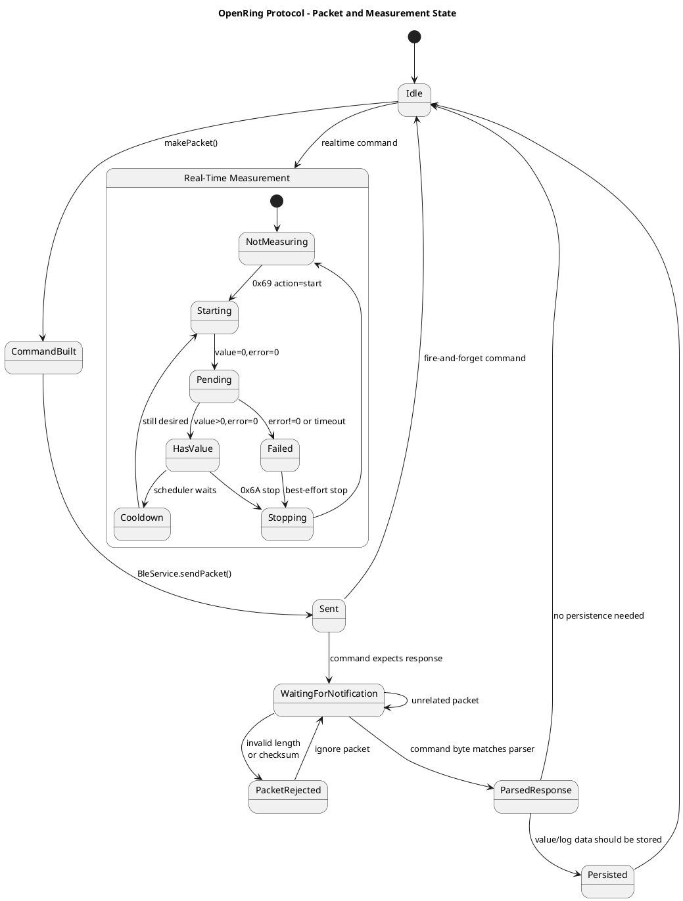

# Colmi Protocol Notes

This document describes the Colmi smart ring protocol behavior currently used
by OpenRing Desktop.

The implementation is based on observed ring behavior and on the Python
`colmi_r02_client` reference implementation by tahnok:

- https://github.com/tahnok/colmi_r02_client

OpenRing has ported the currently needed packet builders and parsers to Dart in
[lib/src/protocol/](../lib/src/protocol/). This document only covers the protocol surface that is
implemented or intentionally considered by OpenRing today.

The Colmi protocol is not fully officially documented. Hardware revisions,
firmware versions, and ring clones may behave differently.

## Transport

Colmi rings expose a Nordic UART-style BLE service.

| Purpose | UUID |
| --- | --- |
| Service | `6E40FFF0-B5A3-F393-E0A9-E50E24DCCA9E` |
| Write characteristic | `6E400002-B5A3-F393-E0A9-E50E24DCCA9E` |
| Notify characteristic | `6E400003-B5A3-F393-E0A9-E50E24DCCA9E` |

OpenRing writes command packets to the write characteristic and receives
response packets through notifications.

The BLE transport code lives in [lib/src/ble/](../lib/src/ble/). Protocol
packet construction and parsing live in [lib/src/protocol/](../lib/src/protocol/).

## Packet Format

All currently used packets are exactly 16 bytes.

| Byte range | Meaning |
| --- | --- |
| `0` | command byte |
| `1..14` | command-specific payload, zero-padded when shorter |
| `15` | checksum |

Checksum:

```text
checksum = sum(bytes 0..14) & 0xFF
```

OpenRing validates this checksum before parsing received packets.

Implementation:

- [packet.dart](../lib/src/protocol/packet.dart)
- `makePacket(command, subData)`
- `validatePacket(data)`

## Protocol State



## Command Bytes

The known command byte is stored in byte `0`.

| Command | Hex | Direction | OpenRing support |
| --- | ---: | --- | --- |
| Set time | `0x01` | app -> ring | build |
| Battery | `0x03` | app <-> ring | build + parse |
| Reboot | `0x08` | app -> ring | build |
| Blink twice | `0x10` | app -> ring | build |
| Read heart-rate log | `0x15` | app <-> ring | build + stateful parse |
| Heart-rate log settings | `0x16` | app <-> ring | build + parse |
| Get steps/activity | `0x43` | app <-> ring | build + stateful parse |
| Start real-time measurement | `0x69` | app <-> ring | build + parse |
| Stop real-time measurement | `0x6A` | app -> ring | build |
| Raw sensor / accelerometer | `0xA1` | app <-> ring | build + parse |

Implementation:

- [commands.dart](../lib/src/protocol/commands.dart)
- [accelerometer.dart](../lib/src/protocol/accelerometer.dart)

## BCD Encoding

Some date/time fields use binary-coded decimal encoding.

Examples:

| Decimal | BCD |
| ---: | ---: |
| `25` | `0x25` |
| `12` | `0x12` |
| `9` | `0x09` |

Implementation:

- [bcd.dart](../lib/src/protocol/bcd.dart)
- `decToBcd`
- `bcdToDec`

## Set Time

Command: `0x01`

OpenRing can set the ring date and time.

Request layout:

| Byte | Meaning |
| ---: | --- |
| `0` | `0x01` |
| `1` | BCD year, last two digits |
| `2` | BCD month |
| `3` | BCD day |
| `4` | BCD hour |
| `5` | BCD minute |
| `6` | BCD second |
| `7` | language flag, currently `1` for English |
| `8..14` | zero padding |
| `15` | checksum |

Implementation:

- [set_time.dart](../lib/src/protocol/set_time.dart)
- `makeSetTimePacket`

Current behavior: OpenRing converts the provided time to UTC before encoding,
matching the Python reference behavior.

## Battery

Command: `0x03`

OpenRing can request and parse the ring battery state.

Request layout:

| Byte | Meaning |
| ---: | --- |
| `0` | `0x03` |
| `1..14` | zero padding |
| `15` | checksum |

Response layout:

| Byte | Meaning |
| ---: | --- |
| `0` | `0x03` |
| `1` | battery level, `0..100` |
| `2` | charging flag, `0` = not charging, non-zero = charging |
| `3..14` | padding |
| `15` | checksum |

Implementation:

- [battery.dart](../lib/src/protocol/battery.dart)
- `makeBatteryRequest`
- `parseBatteryResponse`

## Real-Time Measurements

Commands:

- start/continue: `0x69`
- stop: `0x6A`

OpenRing currently supports real-time readings that are backed by actual sensor
data:

| Reading | Type byte | Unit |
| --- | ---: | --- |
| Heart rate | `1` | `BPM` |
| SpO2 | `3` | `%` |
| HRV | `10` | `ms` |

Other known firmware-defined reading types are intentionally excluded for now,
such as blood pressure, fatigue, health check, ECG, pressure, and blood sugar,
because they are not backed by dedicated sensors in the supported ring hardware.

Start request:

| Byte | Meaning |
| ---: | --- |
| `0` | `0x69` |
| `1` | reading type |
| `2` | action `0x01` = start |
| `3..14` | zero padding |
| `15` | checksum |

Continue request:

| Byte | Meaning |
| ---: | --- |
| `0` | `0x69` |
| `1` | reading type |
| `2` | action `0x03` = continue |
| `3..14` | zero padding |
| `15` | checksum |

Stop request:

| Byte | Meaning |
| ---: | --- |
| `0` | `0x6A` |
| `1` | reading type |
| `2` | `0x00` |
| `3` | `0x00` |
| `4..14` | zero padding |
| `15` | checksum |

Response layout:

| Byte | Meaning |
| ---: | --- |
| `0` | `0x69` |
| `1` | reading type |
| `2` | error code, `0` = OK or still measuring |
| `3` | measured value, `0` while still measuring |
| `4..14` | padding |
| `15` | checksum |

Implementation:

- [real_time.dart](../lib/src/protocol/real_time.dart)
- `makeStartRealTimeRequest`
- `makeContinueRealTimeRequest`
- `makeStopRealTimeRequest`
- `parseRealTimeResponse`

Important behavior: real-time measurement should be treated as a shared sensor
resource. The app should not assume HR, SpO2, and HRV can be measured reliably
in parallel.

## Heart-Rate Log

Command: `0x15`

OpenRing can request stored heart-rate log entries for a given day.

Request layout:

| Byte | Meaning |
| ---: | --- |
| `0` | `0x15` |
| `1..4` | Unix timestamp, little-endian |
| `5..14` | zero padding |
| `15` | checksum |

The response is multi-packet and is assembled by a stateful parser.

Known response sub-types:

| Sub-type | Meaning |
| ---: | --- |
| `0x00` | metadata packet |
| `0x01` | first data packet with base timestamp |
| `0x02+` | continuation data packet |
| `0xFF` | no data available |

Metadata packet:

| Byte | Meaning |
| ---: | --- |
| `0` | `0x15` |
| `1` | `0x00` |
| `2` | total packet count |
| `3` | logging interval in minutes |

First data packet:

| Byte range | Meaning |
| --- | --- |
| `0` | `0x15` |
| `1` | `0x01` |
| `2..5` | base Unix timestamp, little-endian |
| `6..14` | 9 heart-rate values |

Continuation packet:

| Byte range | Meaning |
| --- | --- |
| `0` | `0x15` |
| `1` | `0x02+` |
| `2..14` | 13 heart-rate values |

OpenRing skips zero values and reconstructs timestamps from the base timestamp
plus `index * intervalMinutes`.

Implementation:

- [hr_log.dart](../lib/src/protocol/hr_log.dart)
- `makeHrLogRequest`
- `HrLogParser`

## Heart-Rate Log Settings

Command: `0x16`

OpenRing can query and update the automatic heart-rate logging settings stored
on the ring.

Query request:

| Byte | Meaning |
| ---: | --- |
| `0` | `0x16` |
| `1` | `0x01` = query |
| `2..14` | zero padding |
| `15` | checksum |

Set request:

| Byte | Meaning |
| ---: | --- |
| `0` | `0x16` |
| `1` | `0x02` = set |
| `2` | enabled flag, `1` = on, `2` = off |
| `3` | interval in minutes |
| `4..14` | zero padding |
| `15` | checksum |

Response layout:

| Byte | Meaning |
| ---: | --- |
| `0` | `0x16` |
| `1` | sub-command echo |
| `2` | enabled flag, `1` = on, `2` = off |
| `3` | interval in minutes |
| `4..14` | padding |
| `15` | checksum |

Implementation:

- [hr_settings.dart](../lib/src/protocol/hr_settings.dart)
- `makeHrLogSettingsQuery`
- `makeHrLogSettingsSet`
- `parseHrLogSettings`

## Step and Activity Data

Command: `0x43`

OpenRing can request step/activity data for a given day.

Request layout:

| Byte | Meaning |
| ---: | --- |
| `0` | `0x43` |
| `1` | BCD year, last two digits |
| `2` | BCD month |
| `3` | BCD day |
| `4..14` | zero padding |
| `15` | checksum |

The response is multi-packet and is assembled by a stateful parser.

Known response forms:

| Marker | Meaning |
| ---: | --- |
| `data[1] == 0xF0` | init packet, includes calorie protocol version |
| `data[1] == 0xFF` | no data available |
| otherwise | activity interval data packet |

Data packet layout:

| Byte range | Meaning |
| --- | --- |
| `0` | `0x43` |
| `1..3` | BCD date |
| `4` | time index, `0..95`, each index is 15 minutes |
| `5` | current packet index |
| `6` | total packet count |
| `7..8` | calories, 16-bit little-endian |
| `9..10` | steps, 16-bit little-endian |
| `11..12` | distance in meters, 16-bit little-endian |
| `13..14` | padding or unused |
| `15` | checksum |

Implementation:

- [steps.dart](../lib/src/protocol/steps.dart)
- `makeStepsRequest`
- `StepParser`

## Accelerometer

Command: `0xA1`

OpenRing can enable, disable, and parse raw accelerometer streaming.

This command is kept outside the main `Cmd` class because it is less commonly
used and behaves like a raw sensor stream command.

Start request:

| Byte | Meaning |
| ---: | --- |
| `0` | `0xA1` |
| `1` | `0x04` = enable |
| `2` | `0x04` = accelerometer mode |
| `3..14` | zero padding |
| `15` | checksum |

Stop request:

| Byte | Meaning |
| ---: | --- |
| `0` | `0xA1` |
| `1` | `0x02` = disable |
| `2..14` | zero padding |
| `15` | checksum |

Data response:

| Byte range | Meaning |
| --- | --- |
| `0` | `0xA1` |
| `1` | `0x03` = data packet |
| `2..3` | X axis, signed 16-bit big-endian |
| `4..5` | Y axis, signed 16-bit big-endian |
| `6..7` | Z axis, signed 16-bit big-endian |
| `8..14` | padding |
| `15` | checksum |

Implementation:

- [accelerometer.dart](../lib/src/protocol/accelerometer.dart)
- `makeAccelerometerStartRequest`
- `makeAccelerometerStopRequest`
- `parseAccelerometerResponse`

Observed behavior: stock firmware appears to stream at about 1 Hz. Custom
firmware may support faster rates. Resting-ring packets observed during
development decode plausibly only when the axis pairs are read as big-endian.

## Utility Commands

### Blink Twice

Command: `0x10`

OpenRing can send a no-payload command that makes the ring LEDs blink twice.
This is useful for identifying the connected ring.

Implementation:

- [utility.dart](../lib/src/protocol/utility.dart)
- `makeBlinkTwicePacket`

### Reboot

Command: `0x08`

Request layout:

| Byte | Meaning |
| ---: | --- |
| `0` | `0x08` |
| `1` | `0x01` |
| `2..14` | zero padding |
| `15` | checksum |

The ring disconnects after receiving this command.

Implementation:

- [utility.dart](../lib/src/protocol/utility.dart)
- `makeRebootPacket`

## Testing

Protocol behavior should be covered by focused unit tests.

Existing tests live in [test/protocol/](../test/protocol/) and cover:

- packet construction and checksum validation
- battery request/response behavior
- BCD conversion
- real-time measurement packets and parsing
- heart-rate log assembly
- heart-rate settings
- step/activity log assembly
- accelerometer packets and signed 16-bit parsing

Some tests use golden packets from the Python reference implementation to make
sure Dart packet construction stays compatible.

## Known Unknowns

The following areas are intentionally not treated as stable protocol facts yet:

- exact behavior across all Colmi ring models and firmware versions
- unsupported real-time reading types such as blood pressure or blood sugar
- sleep data formats
- stress data formats
- full activity protocol variants
- firmware update behavior
- whether all timestamp fields should be interpreted as UTC or local time
- edge cases for multi-packet log transmission and retries

When adding support for new protocol areas, prefer small packet builders,
small parsers, golden packet tests, and documentation updates in this file.
